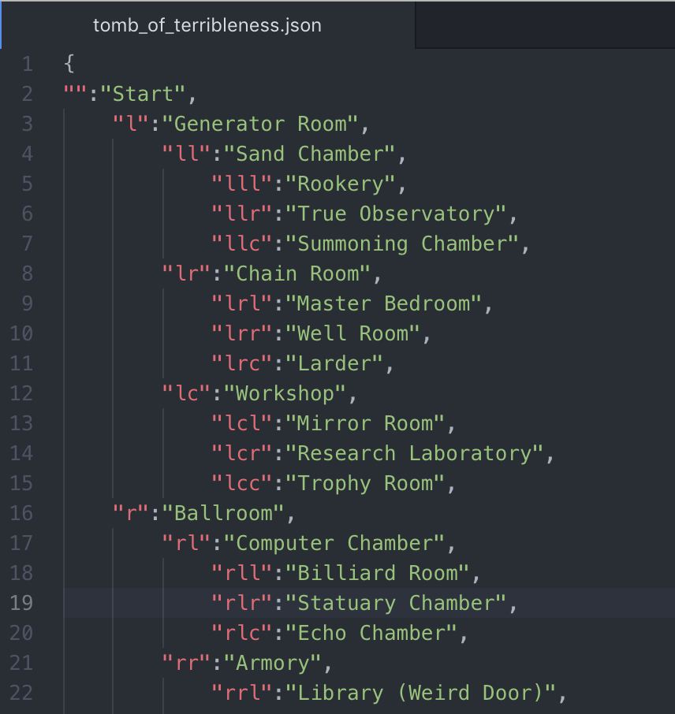
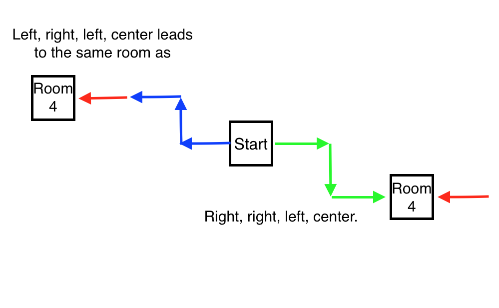

# RPG Tools

This contains some simple tools I've written for a D&D game I'm running. The code in src/ that simulates a dungeon the players are currently exploring. For the most part the dungeon is pretty vanilla (a lot of your standard fantasy tropes), the tricky bit is that the dungeon's creator was messing around with *spooky forces*, and as a result the dungeon is non-euclidean. 

## The dungeon's rules:

Each room is a square 50 feet on a side, and each room has 4 doors leading to other rooms.

The players start in the room marked "Start", and from there every combination of "left", "right", and "center" leads to a different room (to a depth of 3 turns). These are ennumerated in the tomb_of_terribleness.json document. This means that - for example - four left turns does not lead back to the room you started in. 

Because the number of rooms can quickly become ungainly I've limited the dungeon to a "depth" of three turns. That is to say, from the "Start" room, every combination of left, right, and center to a "depth" of three choices will lead to a different room. After that, the players loop back to the other side.

